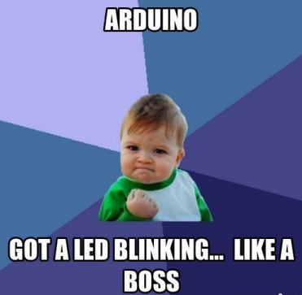

# CbD Sensor Lab Cheat Sheet!



## Find Yourself in a Pickle?
We all do sometimes. No fear, we've got your back! Click on your sensor from the list below to check out the fritzing diagram to wire your hardware and the code to make it work.

### Sensor Menu
<ul>
  <li><a href="#joystick">Joystick</a></li>
  <li><a href="#laser">Laser</a></li>
  <li><a href="#microphone">Microphone</a></li>
  <li><a href="#piezo">Piezo</a></li>
  <li><a href="#photoresistor">Photoresistor</a></li>
  <li><a href="#rgb">RGB Led</a></li>
  <li><a href="#servo">Servo</a></li>
  <li><a href="#misc">Misc</a></li>
</ul>

<h2 id="joystick">Joystick</h2>

</br>

```
var five = require("johnny-five");
var board = new five.Board();

board.on("ready", function() {

  // Create a new `joystick` hardware instance.
  var joystick = new five.Joystick({
    //   [ x, y ]
    pins: ["A0", "A1"]
  });

  joystick.on("change", function() {
    console.log("Joystick");
    console.log("  x : ", this.x);
    console.log("  y : ", this.y);
    console.log("--------------------------------------");
  });

});
```

<h2 id="laser">Laser</h2>

</br>

```
var five = require("johnny-five");
var board = new five.Board();

board.on("ready", function() {
  // Create a new `Led` hardware instance named laser.
  var laser = new five.Led(3);

  laser.on();

});
```

<h2 id="microphone">Microphone</h2>

</br>

```
var five = require("johnny-five");
var board = new five.Board();

board.on("ready", function() {
  var mic = new five.Sensor("A0");
  var led = new five.Led(11);

  // This mic will make an led brightness change based on the sound
  mic.on("data", function() {
    led.brightness(this.value >> 2);
  });
});
```

<h2 id="piezo">Piezo</h2>

</br>

```
var five = require("johnny-five"),
var board = new five.Board();

board.on("ready", function() {
  // Creates a piezo object defining the pin to be used for the signal
  var piezo = new five.Piezo(3);

  // Plays a song
  piezo.play({
    // The song below is composed with 2 arguments
    // The first argument is the note (null means "no note")
    // The second argument is the length of time of the note or (based on a beat)
    song: [
      ["C4", 1 / 4],
      ["D4", 1 / 4],
      ["F4", 1 / 4],
      ["D4", 1 / 4],
      ["A4", 1 / 4],
      [null, 1 / 4],
      ["A4", 1],
      ["G4", 1],
      [null, 1 / 2],
      ["C4", 1 / 4],
      ["D4", 1 / 4],
      ["F4", 1 / 4],
      ["D4", 1 / 4],
      ["G4", 1 / 4],
      [null, 1 / 4],
      ["G4", 1],
      ["F4", 1],
      [null, 1 / 2]
    ],
    tempo: 100
  });

});
```

<h2 id="photoresistor">Photoresistor</h2>

</br>

```
var five = require("johnny-five");
var board = new five.Board();

board.on("ready", function() {
  var photoresistor;

  // Create a new `photoresistor` hardware instance.
  photoresistor = new five.Sensor({
    pin: "A2",
    freq: 250
  });

  // "data" get the current reading from the photoresistor
  photoresistor.on("data", function() {
    console.log(this.value);
  });
});
```

<h2 id="rgb">RGB Led</h2>

</br>

```
var five = require("johnny-five");
var board = new five.Board();

board.on("ready", function() {

  // Initialize the RGB Led
  var led = new five.Led.RGB({
    pins: {
      red: 3,
      green: 5,
      blue: 6
    }
  });

// Turn it on and set the initial color
led.on();
led.color("#0000ff");
led.blink(1000);

});
```

<h2 id="servo">Servo</h2>

</br>

```
var five = require("johnny-five");
var board = new five.Board();

board.on("ready", function() {
  var servo = new five.Servo(10);

  // Servo alternate constructor with options
  var servo = new five.Servo({
    id: "MyServo",     // User defined id
    pin: 10,           // Which pin is it attached to?
    type: "standard",  // Default: "standard". Use "continuous" for continuous rotation servos
    range: [0,180],    // Default: 0-180
    fps: 100,          // Used to calculate rate of movement between positions
    invert: false,     // Invert all specified positions
    startAt: 90,       // Immediately move to a degree
    center: true,      // overrides startAt if true and moves the servo to the center of the range
  });

  // min() - set the servo to the minimum degrees
  // defaults to 0
  // servo.min();

  // max() - set the servo to the maximum degrees
  // defaults to 180
  // servo.max();

  // center() - centers the servo to 90°
  // servo.center();

  // to( deg ) - Moves the servo to position by degrees
  // servo.to( 90 );

  // step( deg ) - step all servos by deg
  // array.step( -20 );

  // or use sweep() to automate all of the above
  servo.sweep();
});
```

<h2 id="misc">Misc</h2>

Still find yourself confused on what exactly is going on with your sensor? Here's a couple of questions to ask yourself or your buddy:

1. Is my sensor an input or an output?
In other words, will my sensor send information to my computer in order FINISH

2. In my sensor analog or digital FINISH

3. FINISH
