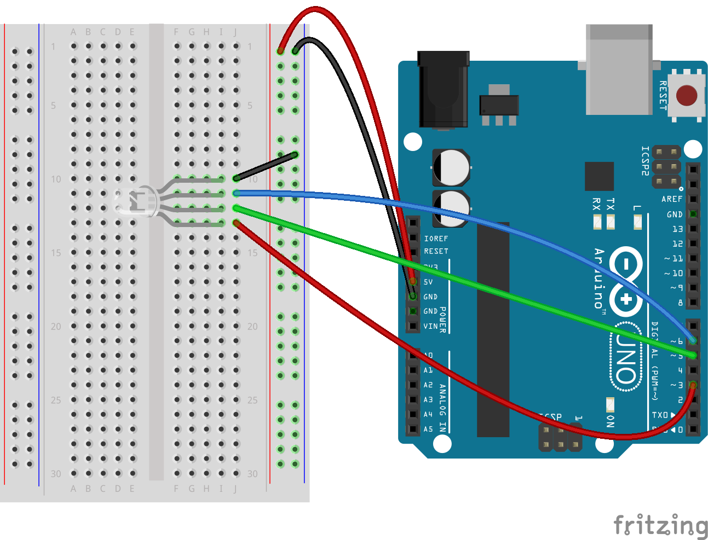

# CbD Sensor Lab Cheat Sheet!


## Find Yourself in a Pickle?
We all do sometimes. No fear, we've got your back! Click on your sensor from the list below to check out the fritzing diagram to wire your hardware and the code to make it work.

### Sensor Menu
<ul>
  <li><a href="#joystick">Joystick</a></li>
  <li><a href="#laser">Laser</a></li>
  <li><a href="#microphone">Microphone</a></li>
  <li><a href="#piezo">Piezo</a></li>
  <li><a href="#photoresistor">Photoresistor</a></li>
  <li><a href="#rgb">RGB Led</a></li>
  <li><a href="#servo">Servo</a></li>
  <li><a href="#misc">Misc</a></li>
</ul>

<h2 id="joystick">Joystick</h2>

</br>
```
var five = require("johnny-five");
var board = new five.Board();

board.on("ready", function() {
  // Before using this code look on the sensor and dbl check that the wires are connected to the right pins on the bread board and on the Arduino (each pin is labeled on the sensor - GND, 5V, VRx, VRy)

  // Create a new `joystick` hardware instance.
  var joystick = new five.Joystick({
    //   [ x, y ]
    pins: ["A0", "A1"]
  });

  joystick.on("change", function() {
    console.log("Joystick");
    console.log("  x : ", this.x);
    console.log("  y : ", this.y);
    console.log("--------------------------------------");
  });

});
```

<h2 id="laser">Laser</h2>

</br>
```
var five = require("johnny-five");
var board = new five.Board();

board.on("ready", function() {
  // Create a new `Led` hardware instance named laser.
  var laser = new five.Led(3);

  laser.on();

});
```
<h2 id="microphone">Microphone</h2>

</br>
```
var five = require("johnny-five");
var board = new five.Board();

board.on("ready", function() {
  var mic = new five.Sensor("A0");

  // This will print the microphone value in your terminal
  mic.on("data", function() {
    console.log(this.value);
  });

  //Once see you the microphone value printing in the console, maybe try and turn the led on when it goes above a certain value

});
```

<h2 id="piezo">Piezo</h2>

</br>
```
var five = require("johnny-five"),
var board = new five.Board();

board.on("ready", function() {
  // Creates a piezo object defining the pin to be used for the signal
  var piezo = new five.Piezo(3);

  // Plays a song
  piezo.play({
    // The song below is composed with 2 arguments
    // The first argument is the note (null means "no note")
    // The second argument is the length of time of the note or (based on a beat)
    song: [
      ["C4", 1 / 4],
      ["D4", 1 / 4],
      ["F4", 1 / 4],
      ["D4", 1 / 4],
      ["A4", 1 / 4],
      [null, 1 / 4],
      ["A4", 1],
      ["G4", 1],
      [null, 1 / 2],
      ["C4", 1 / 4],
      ["D4", 1 / 4],
      ["F4", 1 / 4],
      ["D4", 1 / 4],
      ["G4", 1 / 4],
      [null, 1 / 4],
      ["G4", 1],
      ["F4", 1],
      [null, 1 / 2]
    ],
    tempo: 100
  });

});
```

<h2 id="photoresistor">Photoresistor</h2>

</br>
```
var five = require("johnny-five");
var board = new five.Board();

board.on("ready", function() {
  var photoresistor;

  // Create a new `photoresistor` hardware instance.
  photoresistor = new five.Sensor({
    pin: "A2",
    freq: 250
  });

  // "data" get the current reading from the photoresistor
  photoresistor.on("data", function() {
    console.log(this.value);
  });

  // Once see you the photoresistor value printing in the console, maybe try and turn the led on when it goes above a certain value

});
```

<h2 id="rgb">RGB Led</h2>

</br>
```
var five = require("johnny-five");
var board = new five.Board();

board.on("ready", function() {

  // Initialize the RGB Led
  var led = new five.Led.RGB({
    pins: {
      red: 3,
      green: 5,
      blue: 6
    }
  });

// Turn it on and set the initial color
led.on();
led.color("#0000ff");
led.blink(1000);

});
```

<h2 id="misc">Misc</h2>

Still find yourself confused on what exactly is going on with your sensor? Here's a couple of questions to ask yourself or your buddy:

1. Is my sensor an input or an output?
In other words, will my sensor send information to my computer in order FINISH

2. In my sensor analog or digital FINISH

3. FINISH
